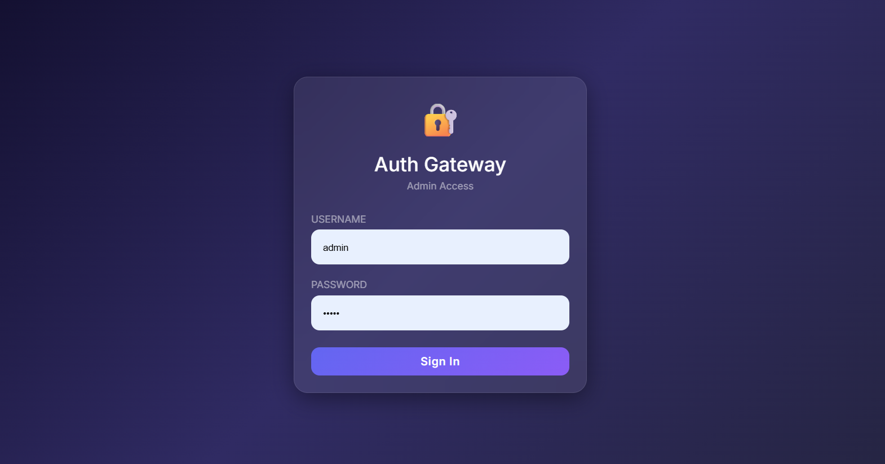
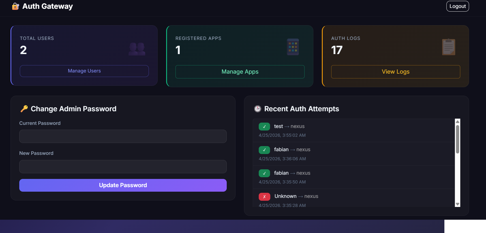
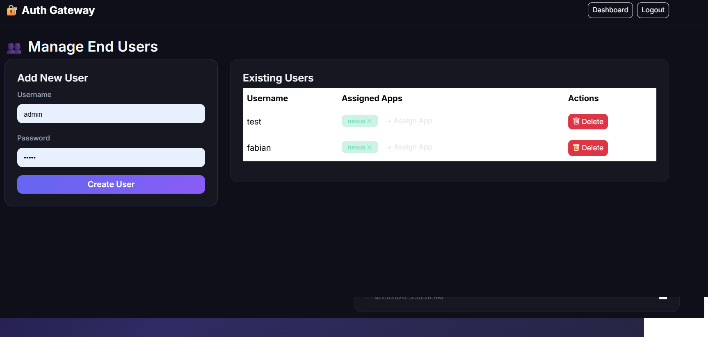
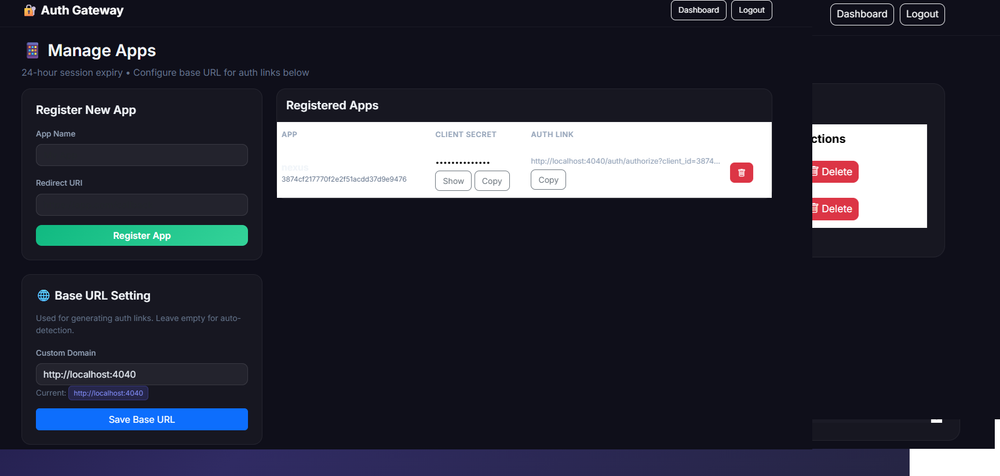
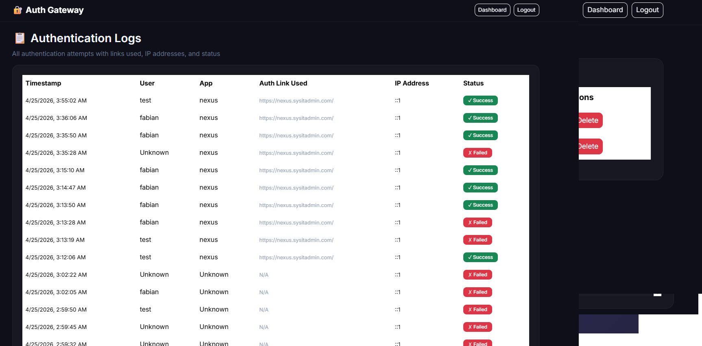
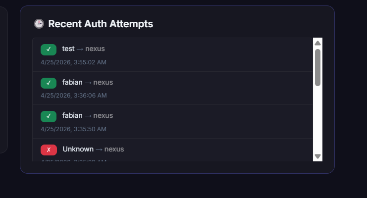

# 🔐 Auth Gateway

A modern authentication gateway application that acts as a middleware to verify and control access to your other applications. Built with Node.js, Express, SQLite, and Docker.


## ✨ Features

- **🔑 Admin Management**: Secure admin panel with default credentials (`admin`/`admin`)
- **👥 Multi-User Support**: Create and manage end-users for application access
- **📱 App Registration**: Register third-party applications to protect
- **🔗 Access Control**: Assign specific users to specific applications
- **📋 Auth Logging**: Track all authentication attempts with IP, timestamp, and status
- **🐳 Dockerized**: Easy deployment with Docker Compose on port 4040
- **🎨 Modern UI**: Clean, responsive interface using Bootstrap 5
- **🔒 Session Management**: Secure session handling with SQLite session store

## 📸 Screenshots

> 📝 **Note**: Add your own screenshots to the `screenshots/` folder and update the paths below

| Page | Screenshot |
|------|------------|
| Admin Login |  |
| Admin Dashboard |  |
| User Management |  |
| App Management |  |
| Auth Logs |  |
| End-User Login |  |

## 🚀 Quick Start

### Prerequisites
- Docker & Docker Compose (recommended)
- OR Node.js 18+ and npm

### Deploy with Docker (Recommended)
1. Clone the repository:
   ```bash
   git clone https://github.com/yourusername/auth-gateway.git
   cd auth-gateway
   ```

2. Start the application:
   ```bash
   docker-compose up -d
   ```

3. Access the admin panel:
   ```
   http://localhost:4040
   ```
   Default login: `admin` / `admin`

### Manual Deployment
1. Install dependencies:
   ```bash
   npm install
   ```

2. Start the server:
   ```bash
   npm start
   ```

3. Access at `http://localhost:4040`

## 🛠️ Usage Guide

### 1. Admin Setup
- Login with default credentials (`admin`/`admin`)
- **IMPORTANT**: Change the default admin password immediately via the dashboard

### 2. Register Protected Apps
1. Go to **Manage Apps** → **Register New App**
2. Enter:
   - App Name: Your application's name
   - Redirect URI: Where to redirect after successful authentication (e.g., `https://yourapp.com/callback`)
3. Note the generated `Client ID` for your app integration

### 3. Create End Users
1. Go to **Manage Users** → **Add New User**
2. Create usernames/passwords for users who need app access

### 4. Assign Users to Apps
- After creating users and apps, use the admin panel to assign specific users to specific apps
- Only assigned users will be able to access the protected apps

### 5. Integrate with Third-Party Apps
In your protected applications, redirect users to the Auth Gateway for authentication:

```javascript
// Example: Redirect to Auth Gateway for login
const authUrl = `http://localhost:4040/auth/authorize?client_id=YOUR_CLIENT_ID&redirect_uri=YOUR_REDIRECT_URI`;
window.location.href = authUrl;
```

After successful authentication, users will be redirected back to your app with:
```
YOUR_REDIRECT_URI?auth=success&user=username
```

## 📊 Database Schema

The app uses SQLite with the following tables:
- `users`: Stores admin and end-user credentials
- `apps`: Registered third-party applications
- `user_apps`: Links users to apps they can access
- `auth_logs`: Tracks all authentication attempts (links used, IP, status)

Database file is stored in `/data/auth-gateway.db` and persists via Docker volume.

## 🔧 Configuration

| Environment Variable | Default | Description |
|---------------------|---------|-------------|
| `PORT` | 4040 | Port the app runs on |

## 📈 Auth Logs

All authentication attempts are logged including:
- ✅ Successful logins
- ❌ Failed attempts
- 🔗 Links (redirect URIs) used for authentication
- 🌐 IP addresses
- 🕒 Timestamps

View logs in the admin panel under **Auth Logs**.

## 🤝 Contributing

1. Fork the repository
2. Create a feature branch (`git checkout -b feature/your-feature`)
3. Commit changes (`git commit -m 'Add some feature'`)
4. Push to branch (`git push origin feature/your-feature`)
5. Open a Pull Request

## 📄 License

MIT License - feel free to use this project for personal or commercial use.

## ⚠️ Security Notes

- Always change the default admin password immediately after first login
- Use HTTPS in production (place behind a reverse proxy like Nginx)
- Regularly review authentication logs for suspicious activity
- Keep the `data/` folder backed up to preserve user/app data

---

Made with ❤️ for secure application access control
